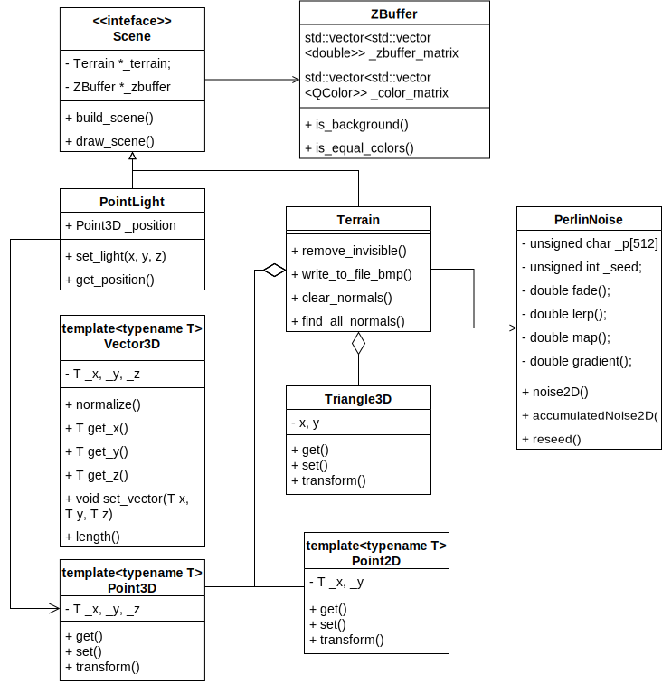
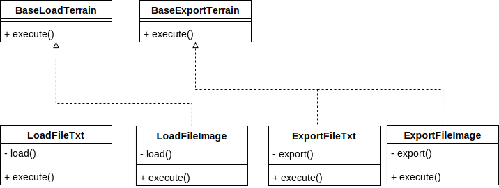
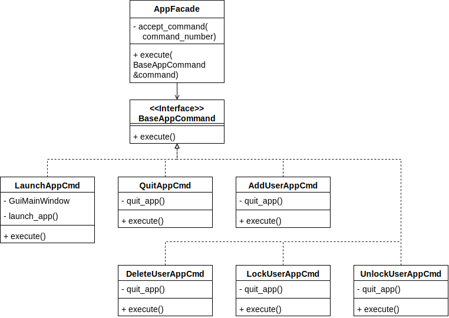

# Генерация трехмерного ландшафта методом шума Перлина

## Описание идеи: 
Разработать программное обеспечение, выполняющее генерацию и визуализацию сцены,
представляющей трехмерный ландшафт. В основу генерации положить шум Перлина.

## Описание предметной области:
Создание процедурно трехмерного ландшафта. Пользователь в интерфейсе может изменять настройки генерации сцены как вручную, так и при пмощи загрузки файла. 

## Анализ аналогичных решений
| Решение        | Критерии     |              |                |
|:--------------:|:------------:|:------------:|:--------------:|
|                | OpenSource   |Порог входа   |Реалистичность  |
| UnrealEngine   |       &#177; |    Высокий   |  1             |
| Unity          |       &#177; |  Высокий     |   2            |
| Godot          |       +      |    Средний   |      3         | 

У таких технологий как UnrealEngine и Unity бесплатное использование продукта, пока доход компании не превысит определенную сумму.

Сравнение реалистичности представлена оценкой, где 1 -- наилучшая из представленных.

## Актуальность и целесообразность проекта
Импортозамещение

## Use-Case диаграмма

## ER-диаграмма сущностей

## Архитектурные харастеристики
В качестве архитектурного паттерна используется MVC.

Приложение содержит сервисно-монолитную архитектуру.

## Технологический стек приложения
Данный проект представляет собой Desktop-приложение. Его реализация выполняется при помощи использования следующих частей: 

1. Язык программирования &ndash; C++ в качестве основного языка. Использование фреймворка QT (Qt5).
2. Хранилище данных:
    
    * обычный файл формата .txt
    * обычный файл формата .bmp
3. Unit-тестирование: использование Gtest.

## Диаграмма компонентов

## Диаграмма классов компонента доступа к данным

## Диаграмма классов компонента бизнес-логики

## Диаграмма «модельных» классов сущности базы данных

## Диаграмма «модельных» классов сущности системы.

## Диаграмма «модельных» классов транспортной сущности.

## Диаграмма классов для MVC

## Диаграмма классов для технологического UI

